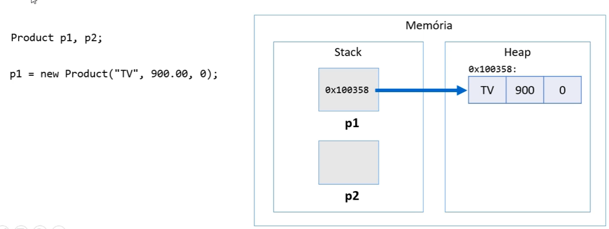
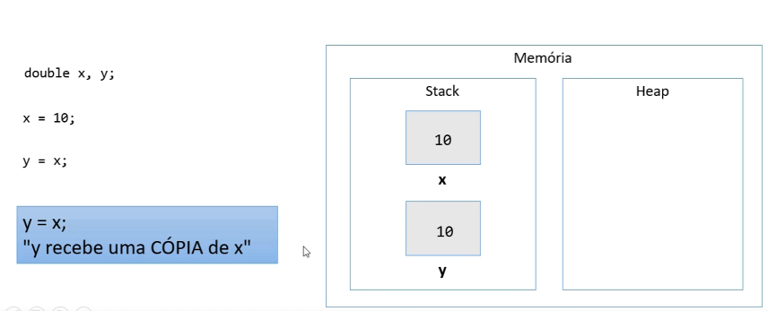
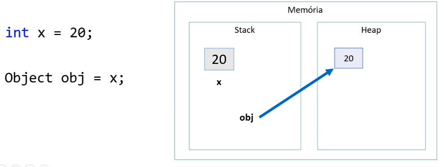
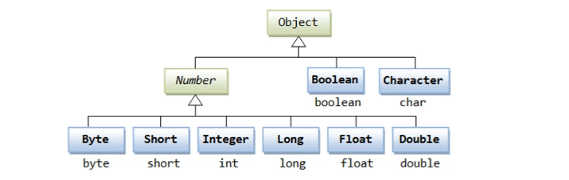

Java Learn
====================

# 1 → Carregamento de memoria, array e listas
---------------------

> Variaveis cujo o tipo são classes não devem ser entendidas como caixas mas sim como ponteiros para a memoria.



> Variaveis baseadas em em classes referenciam a um endereço de memoria.

###  1.1 → Tipos primitivos são tipos valor.
> Tipos primitivos de valor em Java, tipos primitivos são tipos valor, tipos valor são caixas e nao ponteiros para a memoria.



> Se ``` y = x ``` então se cria uma copia do valor da variavel ``` y = 10``` .

### 1.2 → Tipos primitivos do Java

| Type     |    contains        | default   | size
| -------- |    --------        | -------   | ----
| boolean  | true or false      |  false    |  1 bit
| char     | unicode character  |  \u0000   |  16 bit
| byte     | signed integer     |  0        |  8 bits
| short    | signed integer     |  0        |  16 bits
| int      | signed integer     |  0        |  32 bits
| long     | signed integer     |  0        |  64 bits
| float    | floating point     |  0.0      |  32 bits
| double   | floating point     |  0.0      |  64 bits


### 1.3 → Valores padrão

> Quando alocamos New() ou qualquer dado estruturado (classe ou array) se assume valores padrão para seus elementos.

```Java
Product p = new Product();
```


### 1.3 Tipos referência vs. tipos valor

| classe | tipo primitivo
| ---  | ---
| Vantagem: usufrui de todos recursos OO | Vantagem: é mais simples e mais performatico
| Variáveis são ponteiros | Variáveis são caixas
| Objetos precisam ser instanciadas usando new, ou apontar para um objeto já existente. | Não instancia. Uma vez declarados, estão prontos para uso.
| Aceita valor null | Não aceita valor null
| ``` y = x ``` Y passa a apontar para onde X aponta | ``` y = x ``` Y recebe uma cópia de X
| Objetos instanciados no heap | objetos instanciados no stack 
| Objetos não utilizados são desalocados em um momento próximo pelo garbage collector | Objetos são desalocados imediatamente quando seu escopo de execução é finalizado.

> EX:
> 
> neste exemplo mesmo ```p``` sendo uma variável de escopo ela utiliza de uma referencia em memoria para lidar com os dados. 

# 2 → Vetores
---------------------

> Em programação, "vetor" é o nome dado a arranjos unidimensionais

- Arranjo (array) é uma estrutura de dados:
  - Homogênea (dados do mesmo tipo)
  - Ordenada (elementos acessados pelas posições)
  - Alocada de uma vez só, em um bloco contínuo de memória

- Vantagens:
  - Acesso imediato aos elementos pela sua posição

- Desvantagens:
  - Tamanho fixo
  - Dificuldade para se realizar inserções e deleções.

> Exemplo: media de alturas com vetor de tamanho fixo
```Java
    public static void main(String[] args) {
        Scanner sc = new Scanner(System.in);
        int n = sc.nextInt();
        double[] vect = new double[n];

        for (int i=0; i<n; i++) {
            vect[i] = sc.nextDouble();
        }

        double sum = 0.0;

        for (int i=0; i<n; i++) {
            sum += vect[i];
        }

        double avg = sum / n;

        System.out.printf("AVERAGE HEIGHT: %.2f%n", avg);
        sc.close();
    }
```

# 3 → Boxing, unboxing e wrapper classes
---------------------

### 3.1 → Boxing

> É o processo de conversão de um objeto tipo valor para um objeto tipo referência compatível.


```Java
    int x = 20;
    Object obj = x; // <- boxing
```

> Visualmente: 

> 

### 3.2 → Unboxing

> É um processo de conversão de um objeto tipo referência para um objeto tipo valor compatível

```Java
    int x = 20;
    Object obj = x;
    int y = (int) obj; // <- unboxing
```

### 3.3 → Wrapper class

> São classes equivalentes aos tipos primitivos

> Serve para fornecer boxing e unboxing natural a linguagem

> Uso comum: campos de entidades em sistemas de informação

> Pois tipos referencia(classes) aceitam valor null e usufruem dos recursos OO

> 

> Uso em codigo:

```Java
Integer quantity = 10; // <- tipo classe
int packQuantity = quantity * 2; // <- tipo primitivo
(...)
```

```Java
public class Product {
    public String name;
    public Double price;
    public Integer quantity;
    (...)
}
```

### 4 → Laço for each

> Percorre elementos de um vetor.

> Exemplo de codigo:

```Java
    public static void main(String[] args) {
        String[] vect = new String[] {"Maria", "Bob", "Alex"};

        for (int i=0; i<vect.length; i++) { // for comum
            System.out.println(vect[i]);
        }
        
        for (String obj: vect) { // for each
            System.out.println(obj);
        }
    }
```

### 5 → Listas

- Lista é uma estrutura de dados:
  - Homogênea(dados do mesmo tipo)
  - Ordenada (elementos acessados por meio de posições)
  - Inicia vazia, e seus elementos são alocados sob demanda
  - Cada elemento ocupa um 'nó' (ou nodo) da lista

- Tipo (interface): List
- Classes que implementam: ArrayList, LinkedList, etc

- Vantagens:
  - Tamanho variável
  - Facilidade para se realizar inserções e deleções
- Descantagens:
  - Acesso sequencial aos elementos

> Operações de lista

> Tamanho da lista: ```size()```

> Inserir elemento na lista: ```add(obj), add(int, obj)```

> Remover elementos da lista: ```remove(obj), remove(int), removeIf(Predicate)```

> Encontrar posição de elemento: ```indexOf(obj), lastIndexOf(obj)```

> Filtrar lista com base em predicado: ```List<Integer> result = list.stream().filter(x -> x > 4).collect(Collectors.toList());```

> Encontrar primeira ocorrencia com base em predicado: ```Integer result = list.stream().filter(x -> x > 4).findFirst().orElse(null);```

#### Exemplo

```Java
import java.util.*;
import java.util.stream.*;

public class Main {
    public static void main(String[] args) {
        // Declara a lista.
        List<String> list = new ArrayList<>(); 

        // Adiciona itens à lista.
        list.add("Maria");
        list.add("Alex");
        list.add("Bob");
        list.add("Anna");
        list.add(2, "Marco");

        // mostrar comprimento de uma lista
        System.out.println("--- comprimento da lista: --- \n" + list.size() + "\n");

        System.out.println("--- itens da lista ---");
        for (String x: list) {
            System.out.print(x + "\n");
        }

        System.out.println("\n--- itens da lista sem os nomes que iniciam com M ---");
        // list.remove(1); (remove por posição de index)
        list.removeIf(x -> x.charAt(0) == 'M');
        for (String x: list) {
            System.out.print(x + "\n");
            
        }
        System.out.println("\n--- obter index de itens ---");
        System.out.println("Index of Bob: " + list.indexOf("Bob"));
        System.out.println("Index of Marco: " + list.indexOf("Marco") + "\n");
        
        System.out.println("--- Filtrar itens da lista que inciem com o caracter A ---");
        List<String> result = list.stream().filter(x -> x.charAt(0) == 'A').collect(Collectors.toList());
        
        for (String x: result) {
            System.out.println(x);
        }
        
        System.out.println("\n --- Obter o primeiro item de um filtro de lista ---");
        String name = list.stream().filter(x -> x.charAt(0) == 'A').findFirst().orElse(null);
        System.out.println(name);
    }
}
```

### 6 → Matrizes

> Em programação "matriz" é o nome dado a arranjos bidimensionais (vetor de vetores)

> homogênea, ordenada e armazenada de uma só vez no bloco de memoria

> 

> EXEMPLO DE CODIGO:

```Java
import java.util.*;
import java.util.stream.*;

public class Main {
    /*
      Entrada de dados para teste do metodo
      3
      5 -3 10
      15 8 2
      7 9 -4
    */
    public static void main(String[] args) {

		Scanner sc = new Scanner(System.in);
		
		int n = sc.nextInt();
		int[][] mat = new int[n][n];
		/*
		  Até este ponto de execução existe apenas a declaração da matriz
		  - | 0 | 1 | 2
		  0 | 0 | 0 | 0
		  1 | 0 | 0 | 0
		  2 | 0 | 0 | 0
		*/
		System.out.println("inicializa a matriz em memoria");
		String numeroConta = Arrays.deepToString(mat);
		System.out.print(numeroConta);
		
		// Preenche a matriz
		for (int i=0; i<mat.length; i++) { // linhas
			for (int j=0; j<mat[i].length; j++) { // colunas 
				mat[i][j] = sc.nextInt();
			}
		}
		
		// percorre de forma diagonal baseado em indices, 0-0... 1-1... 2-2
		System.out.println("\nMain diagonal:");
		for (int i=0; i<mat.length; i++) {
			System.out.print(mat[i][i] + " ");
		}
		System.out.println();
		
		// percorre linhas e colunas e indica quantas são menores que 0
		int count = 0;
		for (int i=0; i<mat.length; i++) {
			for (int j=0; j<mat[i].length; j++) {
				if (mat[i][j] < 0) {
					count++;
				}
			}
		}
		System.out.println("Negative numbers = " + count);
		
		
		sc.close();
	}
}
```